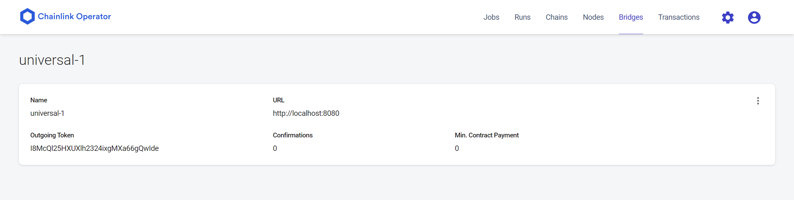

# Chainlink Python Serverless Twitter EA

(adapted from https://github.com/thodges-gh/CL-EA-Python-Template)

This template receives a twitter_id, and returns a boolean checking whether tweet address == input address. Its future implementation will return the resulting address inside said twitter_id, and leave the check to the smart contract

## Configuration:

This script requires a valid Twitter authorization key from https://developer.twitter.com/. Note, we've adapted the script to only use the read-only bearer token, so the account you use shall not be compromised by the use of this script.

Once you have your keys, and a working Chainlink node, add a file named .env to this folder with your BEARER_TOKEN:

```
BEARER_TOKEN=xxxxxx
```
You can run the scripts in a venv/docker with below, or instead run it straight as host with:

pip install -m requirements.txt
python3 app.py

Your node should now be running!

## Connection to Node:

Setup will follow explanation in luksoracle/chainlink-lukso, with two caveats: A Bridge needs to be set up and tested between node and EA, and the TOML file is slightly different.

### Bridge

Create a bridge with the following settings:



:warning: Neither docker nor WSL will be able to communicate to localhost:8080. This is for security reasons. Thus, you will need to either compose the EA with the node, or instead locate your host IP address, and pass that through to the bridge. You should be able to find this via an "ip a" in Linux, or "ipconfig" in Windows.  :warning:

### Connect your bridge to your smart contract

Next, you need to make the request coming from your oracle accessible to your node.

This TOML file should do, but make sure to change the contract address to be your oracle address:

```
type = "directrequest"
schemaVersion = 1
name = ""
contractAddress = "0x401ae6Bfb89448fB6e06CE7C9171a8A0366d02d0" # YOUR CONTRACT ADDRESS
minIncomingConfirmations = 0
observationSource = """
    decode_log   [type=ethabidecodelog
                  abi="OracleRequest(bytes32 indexed specId, address requester, bytes32 requestId, uint256 payment, address callbackAddr, bytes4 callbackFunctionId, uint256 cancelExpiration, uint256 dataVersion, bytes data)"
                  data="$(jobRun.logData)"
                  topics="$(jobRun.logTopics)"]

    decode_cbor  [type=cborparse data="$(decode_log.data)"]
    fetch        [type=bridge name="twitter_1" requestData="{\\"id\\": $(jobSpec.externalJobID), \\"data\\": { \\"twitter_id\\": $(decode_cbor.twitter_id), \\"address_owner\\": $(decode_cbor.address_owner)}}"]
    parse        [type=jsonparse path="result" data="$(fetch)"]
    encode_data  [type=ethabiencode abi="(uint256 value)" data="{ \\"value\\": $(parse) }"]
    encode_tx    [type=ethabiencode
                  abi="fulfillOracleRequest(bytes32 requestId, uint256 payment, address callbackAddress, bytes4 callbackFunctionId, uint256 expiration, bytes32 data)"
                  data="{\\"requestId\\": $(decode_log.requestId), \\"payment\\": $(decode_log.payment), \\"callbackAddress\\": $(decode_log.callbackAddr), \\"callbackFunctionId\\": $(decode_log.callbackFunctionId), \\"expiration\\": $(decode_log.cancelExpiration), \\"data\\": $(encode_data)}"
                 ]
    submit_tx    [type=ethtx to="0x401ae6Bfb89448fB6e06CE7C9171a8A0366d02d0" data="$(encode_tx)"] # YOUR CONTRACT ADDRESS HERE, TOO

    decode_log -> decode_cbor -> fetch -> parse -> encode_data -> encode_tx -> submit_tx
"""
```

## Other running methods, depending on your use case:

### Install

```
pipenv install

```

### Test

```
pipenv run pytest
```

### Run with Docker

Build the image

```
docker build . -t cl-ea
```

Run the container

```
docker run -it -p 8080:8080 cl-ea
```

### Run with Serverless

#### Create the zip

```bash
pipenv lock -r > requirements.txt
pipenv run pip install -r requirements.txt -t ./package
pipenv run python -m zipfile -c cl-ea.zip main.py adapter.py bridge.py ./package/*
```

#### Install to AWS Lambda

- In Lambda Functions, create function
- On the Create function page:
  - Give the function a name
  - Use Python 3.7 for the runtime
  - Choose an existing role or create a new one
  - Click Create Function
- Under Function code, select "Upload a .zip file" from the Code entry type drop-down
- Click Upload and select the `cl-ea.zip` file
- Change the Handler to `main.lambda_handler`
- Save

##### To Set Up an API Gateway

An API Gateway is necessary for the function to be called by external services.

- Click Add Trigger
- Select API Gateway in Trigger configuration
- Under API, click Create an API
- Choose REST API
- Select the security for the API
- Click Add
- Click the API Gateway trigger
- Click the name of the trigger (this is a link, a new window opens)
- Click Integration Request
- Uncheck Use Lamba Proxy integration
- Click OK on the two dialogs
- Return to your function
- Remove the API Gateway and Save
- Click Add Trigger and use the same API Gateway
- Select the deployment stage and security
- Click Add


#### Install to Google Cloud Funcions

- In Functions, create a new function
- Use HTTP for the Trigger
- Optionally check the box to allow unauthenticated invocations
- Choose ZIP upload under Source Code
- Use Python 3.7 for the runtime
- Click Browse and select the `cl-ea.zip` file
- Select a Storage Bucket to keep the zip in
- Function to execute: `gcs_handler`
- Click Create
